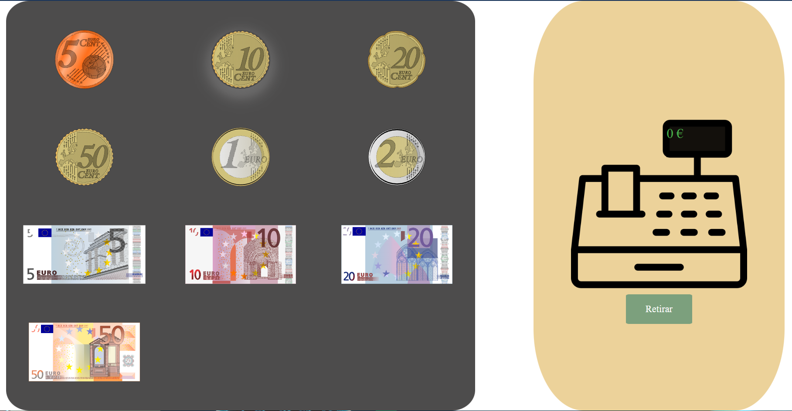
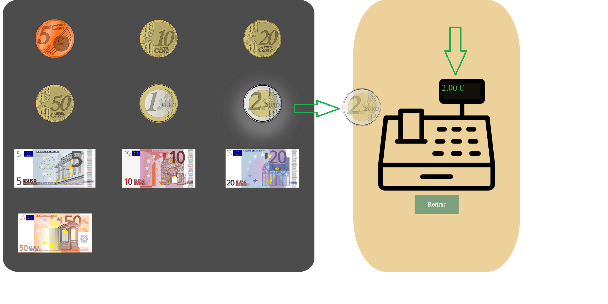
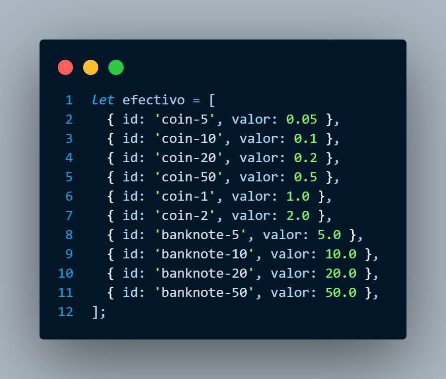
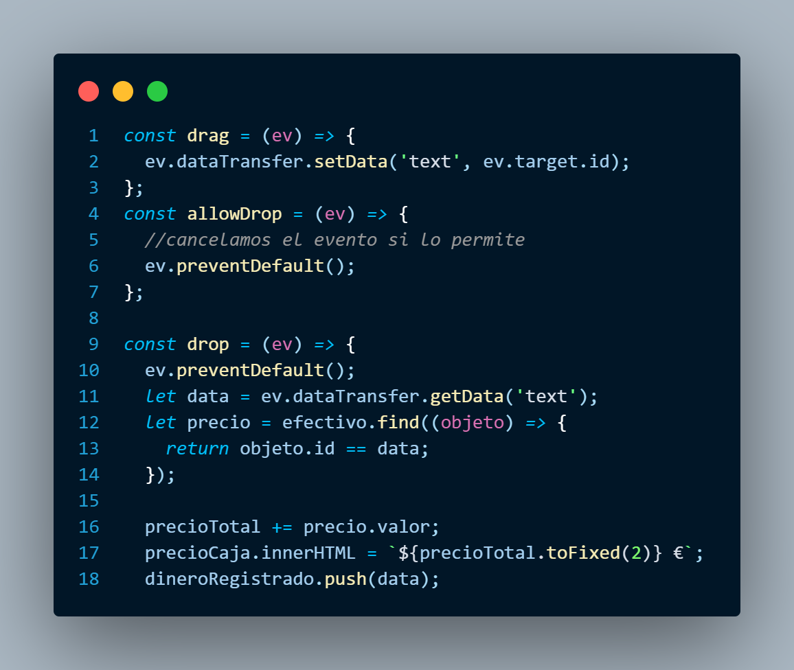

# Proyecto-Final-Bootcamp

Creación de un show case utilizando lo aprendido en Bootcamp con HTML, CSS y JS

# Objetivos

_Realizar una app funcional la cual podamos arrastrar varios elementos y soltarlos a un carrito o una caja registradora en este caso, para que un contador vaya sumando el valor quetenga cada elemento, e implementar un botón de resetearlo._

## Tecnologias 🛠️

- [HTML](https://devdocs.io/html/) - Para crear la estructura de la web

- [CSS](https://devdocs.io/css/)- Para dar estilo a la web    
-  [JAVASCRIPT](https://devdocs.io/javascript/) - Usado para hacer la web dinámica
## Comenzando 🚀

_La interfaz de la app que encontraremos al ejecutarla será esta que encontramos a continuación._

_Arrastrando cualquiera de los elementos a la caja, hará que el marcador aumente y nos lo indique._

Para ejecutar la aplicación pulsa [DEPLOY](https://github.com/adria-vidal)

### Pre-requisitos 📋

_No se necesita instalar nada, solo tener un navegador para abrir el archivo_

##Acceso y Despliegue  📁

_Acceder al repositorio del proyecto y pulsar sobre github-pages en la parte inferior derecha y a continuación pulsar "View Deployment"_

## Implementaciones futuras 📌

1. Contar cantidad de cada billete o moneda que ha en la caja registradora
2. Insertar precio de un producto, cliente da el dinero, la caja nos indica el cambio a devolver.
3. Mejorar el diseño estético de la web

## Versionado 📌

Usamos [Github](https://github.com/) para el versionado. Para todas las versiones disponibles, mira los [tags en este repositorio](https://github.com/adria-vidal/Proyecto-Final-Bootcamp).

## Funcionamiento

1. Declaramos un objeto con todas las posibles monedas y billetes que podemos ingresar en la caja registradora con su respectivo valor

 2.Estas serán las funciones que se activarán al arrastrar y soltar los elementos en el cual obtendremos el identificador del objeto al arrastrar y al soltar obtendremos el valor de dicho elemento sumandolo y pasandolo al HTML para mostrarlo por pantalla
 

## Autores ✒️

- **Adrià Vidal** - _Trabajo Inicial_ - [adria-vidal](https://github.com/adria-vidal)

## Expresiones de Gratitud 🎁

- Dona con cripto ( ETH ) a esta dirección: `0xA286468823b4bc057B06F37c9F2B9CFbC3Afa0F4`

---

hecho por [Adrià Vidal](<(https://github.com/adria-vidal)>) 😊
